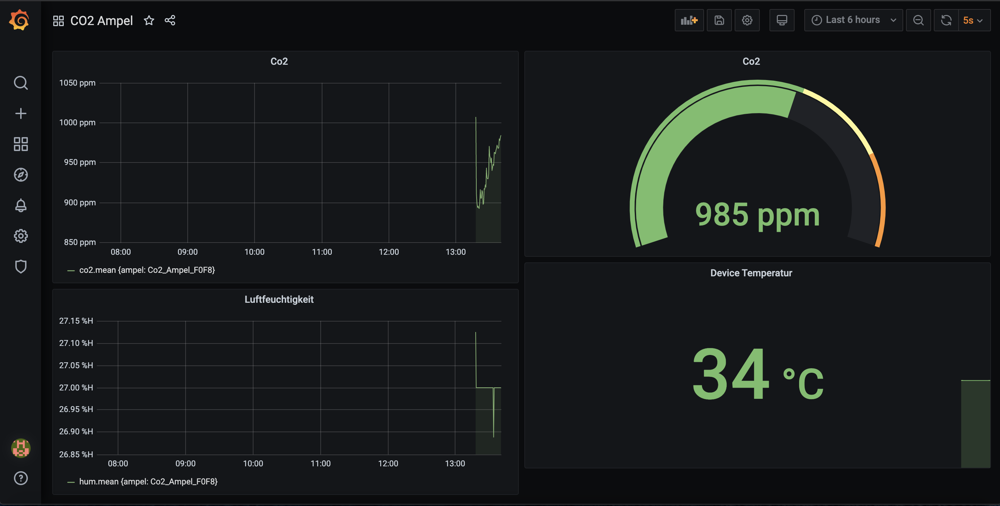

# Watterott CO2 Ampel Monitoring
This Repository provides a ready to use Co2 Monitoring system for multiple Watterott Co2 Ampel Devices. The system comes with a simple preconfigured Dashboard. Every device is added automatically to the charts by using [InfluxDBs line protocol](https://docs.influxdata.com/influxdb/v1.8/write_protocols/line_protocol_tutorial/) tag_set.





## Installation

Install docker and docker-compose on your system.

### Windows
Install docker like described on 

[https://docs.docker.com/docker-for-windows/install/](https://docs.docker.com/docker-for-windows/install/)

Install docker-compose like described on
[https://docs.docker.com/compose/install/](https://docs.docker.com/compose/install/)

### MacOS

Install docker like described on 

[https://docs.docker.com/docker-for-mac/install/](https://docs.docker.com/docker-for-mac/install/)

Install docker-compose like described on
[https://docs.docker.com/compose/install/](https://docs.docker.com/compose/install/)

### Raspberry Pi
Installing Docker

``` 
sudo curl -fsSL https://get.docker.com | sh 
sudo apt-get install docker-compose

```

Enable Docker at Raspberry Pi boot

```
sudo systemctl enable docker
```

Start Docker daemon

```
sudo systemctl start docker
```

### Debian/Ubuntu
Installing Docker

``` 
sudo curl -fsSL https://get.docker.com | sh 
sudo apt-get install docker-compose
```

Enable Docker at systeem boot

```
sudo systemctl enable docker
```

Start Docker daemon

```
sudo systemctl start docker
```


## Starting the Environment

```
docker-compose up -d
```

## Stopping the Environment

```
docker-compose down 
```

## Usage

Start the system with docker-compose like described before. 
Connect your Watterott Co2 Ampel to the power supply.

Finally point you Browser to 

```
http://[ip_address_of_your_device]:3000
```

Log in with username __admin__ and password __admin__. 

---

**!NOTE!**

You should change the password! Otherwise you will be promoted to the change password page every time you try to connect.

---

## Troubleshoot

### Login as admin does not work.

You can set a new password for user admin by the following command.

```
sudo docker exec -it grafana grafana-cli admin reset-admin-password <new_password>
```

### Start with a fresh Database.

You can clear the database by removing the data folder in docker/influx
Stop the system like described in section Stopping. 

Remove the database by using the following command:

```
rm -R docker/influx/data
```

Start the system like described in the Starting section. The database is 
empty now.
